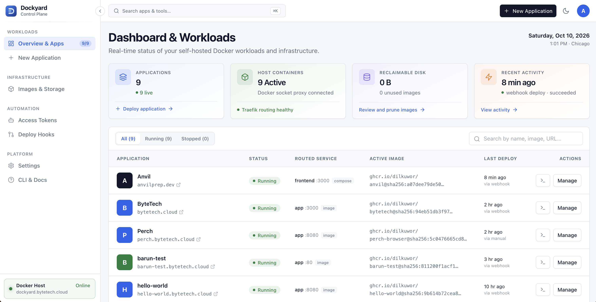

# Dockyard

A small self-hosted cloud for one Docker machine. Deploy an image or a compose
file and get an address for it: a local one out of the box, or a public HTTPS
address on your own domain once you connect Cloudflare. Push to GitHub and the
new version deploys itself.



```
GitHub Actions ── build & push ──▶ ghcr.io / Docker Hub
      │
      └── signed POST /api/hooks ──▶ Cloudflare ──▶ cloudflared ──▶ Traefik ──▶ Dockyard
                                                                      │            │
                  visitor ── my-app.example.com ──▶ ──────────────────┘            ▼
                                                             app containers ◀── docker compose up
```

## What it does

- Runs single images or multi-service compose files, each at its own address.
- Local addresses with no setup; public HTTPS through a Cloudflare tunnel, set up
  for you from the dashboard. No router ports are opened.
- Deploys on every push through a signed hook, pinned to the exact image digest.
- One-click rollback, encrypted environment variables, live logs, CPU and memory.
- Deploy notes: commit message, branch and image digest per deployment, and what
  changed in the compose file and variables since the one before.
- Custom hostnames (`www.example.com`, apex domains) on top of each app's address.
- Preview deployments: every branch gets its own address, removed with the branch.
- Managed add-ons: PostgreSQL, Redis or MinIO next to the app, with the connection
  details in its environment.
- Updates itself from GitHub from the Settings page.
- Pulls private images from Docker Hub, ghcr.io or any other registry.
- Access tokens and a `dockyard` command, so scripts and AI agents can deploy.
- Cleans up old images, and only the ones it pulled itself.

| Service        | Job                                                                |
| -------------- | ------------------------------------------------------------------ |
| `dockyard`     | API, dashboard and deploy hooks (Node/TypeScript + React).         |
| `traefik`      | Routes each address to the right container.                        |
| `socket-proxy` | Gives Traefik read-only access to Docker.                          |
| `cloudflared`  | Optional tunnel to Cloudflare. Dockyard starts it when you turn on public access. |

## Quick start

You need Docker with the compose plugin.

```bash
cp .env.example .env
openssl rand -hex 32          # paste into DOCKYARD_SECRET
docker compose up -d          # pulls the published image; add --build to build it here
docker compose logs dockyard  # shows the one-time setup code
```

Open `http://dockyard.localhost:8080` on the machine itself. For a remote server,
forward the port first: `ssh -L 8080:localhost:8080 you@server`.

The first visit asks you to create the admin password. It also asks for the setup
code from the logs, so that only someone with access to the machine can claim a
fresh Dockyard. The password can be changed later on the **Platform Settings**
page. (Older installs that set `ADMIN_PASSWORD` in `.env` keep working: it is
imported on the next start and can then be removed from the file.)

Next it asks how apps should be reachable:

- **On this machine only.** Nothing to set up. Apps are served at
  `http://<name>.localhost:8080`. Chrome, Firefox and curl resolve `*.localhost`
  by themselves; Safari may not.
- **On the internet, with your own domain.** See the next section.

You can change the answer at any time on the Platform Settings page
(**Registry Auth** in the sidebar), under **Public access**.

## Public access with Cloudflare

Your domain must already be on Cloudflare. Then, on the first-run screen or under
**Public access**:

1. Create a Cloudflare API token at
   [dash.cloudflare.com/profile/api-tokens](https://dash.cloudflare.com/profile/api-tokens)
   (Create Custom Token) with these permissions:
   - Account · Cloudflare Tunnel · Edit
   - Zone · Zone · Read
   - Zone · DNS · Edit
   - Zone · Zone WAF · Edit
   - Zone · Bot Management · Edit (optional)
2. Paste it, pick the domain, and start the setup.

Dockyard then creates a tunnel named `dockyard-yourdomain`, routes `*.yourdomain`
to it, adds the wildcard DNS record, adds a WAF rule so deploy hooks get past Super
Bot Fight Mode, starts the connector, and checks that the public address answers.
Each step is reported. The API token is kept, encrypted like the other settings,
so domains can be added later without pasting it again; "Forget token" under
Public access drops it.

Apps are then served at `https://<name>.yourdomain` and the dashboard at
`https://dockyard.yourdomain`. The local addresses keep working.

### More than one domain

Under **Settings → Public access → Domains** you can add further domains from the
same Cloudflare account, using the API token saved at setup. Each one gets a route
on the existing tunnel and a wildcard DNS record, so nothing changes on the machine. Pick a domain per app when
creating it or on its Settings tab, with `dockyard deploy --domain example.com`, or
through the API. Apps created without a choice go to the **default** domain, which
you can switch in the same list; changing it only affects apps created afterwards.
The dashboard and deploy hooks stay on the domain chosen at setup. Address names
remain unique across all domains, since routing matches the first label only, so an
app also answers at its name under the other domains.

Good to know:

- **No redeploys.** Apps are routed by the first part of their address, so turning
  public access on or off takes effect at once.
- **Turning it off** stops the connector and switches addresses back to local ones.
  The settings are kept, so it can be switched back on without Cloudflare. The
  tunnel and DNS record stay in your Cloudflare account.
- **The connector is watched.** It runs over HTTP/2, which needs none of the UDP
  buffer tuning QUIC wants from the host, and every minute Dockyard checks the
  public address against a local check through Traefik. If only the public path
  fails twice in a row, the connector is restarted, at most every ten minutes.
- **One tunnel per Dockyard.** If two installs share a tunnel, Cloudflare sends
  some of each domain's requests to the wrong machine, which shows up as random
  502s. Setup therefore refuses to join a tunnel that another machine is connected
  to; tick "Use a separate tunnel" to get one of your own and move the DNS record.
- **One subdomain level.** Cloudflare's free certificate covers `abc.example.com`
  but not `abc.apps.example.com`.
- **Bot Fight Mode (free plan)** can block GitHub from calling deploy hooks and
  cannot be skipped for one address. Setup tells you whether it is on and can turn
  it off for the domain. On paid plans the Super Bot Fight Mode skip rule is enough.
- **Existing DNS records.** If the domain already has a wildcard or a `dockyard`
  record pointing elsewhere, setup stops and says so. Tick "Replace existing DNS
  records" to let it take them over.
- **Doing the Cloudflare side yourself.** Choose "I already have a tunnel" and
  enter your domain and tunnel token. The tunnel needs a published application
  route `*.yourdomain` → `HTTP` → `traefik:80`, and the domain a proxied `CNAME`
  `*` → `<tunnel-id>.cfargotunnel.com`.

### Lock down the dashboard

Dockyard can run anything on its machine, so once it is public, put Cloudflare
Access in front of it:

1. **Zero Trust → Access → Applications → Add** a self-hosted app for
   `dockyard.yourdomain` with a policy that allows only your email.
2. Add a second application for `dockyard.yourdomain/api/hooks` with a **Bypass**
   policy for Everyone, so GitHub can still reach the deploy hooks. Hooks are
   protected by their own signatures.

## Deploying apps

### From the dashboard

**New Application** → choose a single image (for example `nginx:alpine`, port 80)
or paste a compose file. Pick an address or leave it blank for a random one. You
can change the address later on the app's **Settings** tab; it takes effect on the
next deploy.

Each app has tabs for **Deployments** (history, logs, roll back), **Environment**
(variables, encrypted at rest), **Logs** (live), **Deploy hook** and **Settings**.

### On every push to GitHub

This needs public access, because GitHub has to reach Dockyard.

1. Open the app's **Deploy hook** tab and pick GitHub Container Registry or Docker
   Hub.
2. Add the secrets it lists to your GitHub repository and commit the workflow it
   shows. The same workflows are in [`examples/deploy-ghcr.yml`](examples/deploy-ghcr.yml)
   and [`examples/deploy.yml`](examples/deploy.yml).
3. Push to `main`. GitHub builds and pushes the image, then calls the hook, and
   Dockyard deploys that exact image digest.

To use one signing secret for all apps instead of one per app, turn on the
**Global deploy hook** on the **GitHub & Deploy Hooks** page and add it to each
repository as the Actions secret `DOCKYARD_HOOK_SECRET`. Dockyard picks the app
from the image name, so the secret can move an app to another build of its own
image but not to a foreign one.

### With the `dockyard` command or an AI agent

The `dockyard` command sets up the GitHub flow for a project in one step, and an
agent such as Claude Code can run it for you.

1. On the **Agent Access** page, create an access token. It is used instead of
   the admin password and can be rolled or revoked at any time.
2. Install the command on the machine where you or the agent work. The **CLI &
   Docs** page has the commands, with this server's address filled in. It needs
   `git`, `curl` and `jq`.
3. In an app's folder, run `dockyard deploy --port 3000`, or tell the agent:
   *Deploy this app to Dockyard. Run `dockyard guide` first and follow it.*

`dockyard deploy` registers the app, adds a workflow that builds the image and
pushes it to ghcr.io, pushes the branch, and waits until the app is live.
`dockyard status`, `env`, `redeploy` and `logs` cover the rest, and
`dockyard guide` prints this server's deployment guide for agents.

The workflow signs its call with the repository secret `DOCKYARD_HOOK_SECRET`, and
there are three ways for it to get there:

- Add a GitHub token on the **GitHub & Deploy Hooks** page under **GitHub Automation**,
  and Dockyard stores the secret in the repository itself during `dockyard deploy`.
  Use a fine-grained token with the *Secrets: Read and write* permission on the
  repositories you deploy from. An existing secret is left alone;
  `dockyard deploy --reset-secret` overwrites it.
- Without that token and with the global deploy hook on, you add the one global
  secret to the repository yourself.
- Without that token and with the global deploy hook off, the command stores each
  app's own secret for you, which needs the GitHub CLI (`gh auth login`).

### Custom hostnames

On an app's **Settings** tab, under **Custom hostnames**, add `www.example.com` or
`example.com`. The domain must be a zone in the same Cloudflare account as the
tunnel: Dockyard adds a tunnel route and a proxied DNS record with the API token
saved at setup, and Traefik starts routing the name at once through a file
provider, so nothing is redeployed. A name that the wildcard of a configured
domain already covers needs no Cloudflare change at all. The app's own address
keeps working.

### Preview deployments

Turn them on under **Preview deployments** on the app's Settings tab (or
`dockyard deploy --previews`) and run `dockyard deploy` once so the workflow
builds every branch. A push to any branch other than the deploy branch then
creates `<address>-<branch>.<domain>` with the app's compose file, port and
variables, and deleting the branch on GitHub removes it, volumes included. Only
the deploy branch moves the image's `latest` tag.

### Add-ons

**Add-ons** on the Settings tab puts PostgreSQL 16, Redis 7 or MinIO into the app's
compose file as another service with a named volume, and the connection details
into its environment (`DATABASE_URL`, `REDIS_URL`, `S3_ENDPOINT` and friends).
Deploy to start it. Removing an add-on takes the service and variables out again
and keeps the Docker volume.

### Backups

**Settings → Backups** archives Dockyard's own settings (the database and the
rendered compose files) and every app's data volumes into the backup directory,
`.data/backups` next to the compose file unless `BACKUP_DIR` says otherwise. The
Postgres add-on is dumped with `pg_dump` rather than copied, and other volumes are
copied while the app is paused for a few seconds. Set a daily time and how many
runs to keep, or click "Back up now". Previews are never included, and any app
can be left out on its Settings tab. Restore an app's data from one of its backups
on that same tab; the data it had is archived next to the backup first. Copy the
backup directory off the machine, since a backup on the same disk only protects
against mistakes, not against losing the machine.

### Updating Dockyard

Every push to `main` publishes `ghcr.io/dilkuwor/dockyard:latest`, labelled with
the commit it was built from. **Settings → Software update** compares the digest
of the running image with what the registry serves for that tag, lists the commits
that are newer, and updates in place: a helper container runs `docker compose pull`
and `docker compose up -d` for the `dockyard` service, then removes the old image.
Apps keep running; the dashboard is away for about a minute. The same thing by hand:

```bash
docker compose pull dockyard && docker compose up -d dockyard
```

An install that builds the image itself (`docker compose up -d --build`) shows as
"built on this machine"; updating it switches it to the published image. If the
package is private, add credentials for ghcr.io under Settings first.

### Private images

Add the registry's credentials on the Platform Settings page, under registry
credentials. Docker Hub, ghcr.io and any other registry are supported. Credentials
are checked when you save them and stored encrypted. Packages on ghcr.io are
private by default, so the GitHub flow usually needs this.

### Compose rules

Apps share one machine, so Dockyard rejects anything that reaches outside the app:

- `build`, `ports`, `privileged`, `network_mode`, `container_name`, `env_file`,
  `extends`, `volumes_from`, `include`
- host `pid`, `ipc`, `uts`, `userns_mode` or `cgroup`
- `cap_add`, `devices`, `security_opt`, `sysctls`
- bind mounts, and external or custom-named networks and volumes
- secrets and configs read from files
- `traefik.*` and `dockyard.*` labels, and the `dockyard_edge` network

Use images, named volumes and the Environment tab instead. The service that gets
the address is joined to the shared `dockyard_edge` network; other services stay
on the app's private network.

### Cleaning up old images

Every deploy pulls an image, and old ones stay on disk. The **Images & Storage**
page lists the images Dockyard pulled that no container uses any more and removes
them on request. It never touches images from anything else on the machine. A
later rollback simply pulls the image again.

## Configuration

Everything else is set from the dashboard. `.env` holds only:

| Variable | Default | Purpose |
| --- | --- | --- |
| `ADMIN_PASSWORD` | none | Legacy. The password is chosen in the dashboard on first visit; a value here is imported once. |
| `DOCKYARD_SECRET` | required | At least 32 characters. Encrypts stored secrets and signs sessions. |
| `LOCAL_PORT` | `8080` | Port for the local addresses. |
| `LOCAL_BIND` | `127.0.0.1` | Set to `0.0.0.0` to offer the local addresses to your network. |
| `DASHBOARD_SUBDOMAIN` | `dockyard` | First part of the dashboard's address. |
| `DEPLOY_WAIT_TIMEOUT` | `120` | Seconds to wait for containers to become healthy on deploy. |
| `GHCR_USERNAME`, `GHCR_TOKEN` | none | Fallback registry credentials; the dashboard's take priority. |
| `DOCKERHUB_USERNAME`, `DOCKERHUB_TOKEN` | none | Same, for Docker Hub. |

Keep `DOCKYARD_SECRET` safe and unchanged. Environment variables, hook secrets,
registry credentials and the tunnel token are encrypted with it, and become
unreadable if it changes.

## Deploy hook reference

```
POST /api/hooks/<app-id>
X-Dockyard-Timestamp: <unix seconds>
X-Dockyard-Signature: sha256=<hex HMAC-SHA256(secret, "<timestamp>.<raw body>")>

{ "image": "yourname/app", "digest": "sha256:…", "commit": "<git sha>" }
```

Requests older than 5 minutes are rejected. `digest` and `commit` are optional;
without `digest`, the image tag is pulled as it is.

With the global deploy hook on, the same request can go to `POST /api/hooks`,
signed with the global secret. `image` is then required, because it selects the
app. [`scripts/test-hook.sh`](scripts/test-hook.sh) sends a signed request by hand.

## Upgrading from a version configured in `.env`

Earlier versions kept `BASE_DOMAIN`, `DASHBOARD_HOST` and
`CLOUDFLARE_TUNNEL_TOKEN` in `.env` and ran `cloudflared` as a compose service.

1. Run `docker compose up -d --build`. On first start the domain and tunnel token
   are imported into the dashboard's settings, and Dockyard starts its own
   connector.
2. Run `docker compose up -d --remove-orphans` to retire the old `cloudflared`
   container.
3. Remove the three variables from `.env`; they are no longer read.

Apps deployed before the upgrade keep answering on your domain. Each one also gets
its local address the next time it is deployed.

## Development

```bash
# terminal 1: API on :3000 (needs Docker running locally)
cp .env.example .env    # add DATA_DIR=./.data and the two required values
cd server && npm install && npm run dev

# terminal 2: dashboard on :5173, proxies /api to :3000
cd web && npm install && npm run dev
```

Pushing to `main` publishes this repository's own image to
`ghcr.io/<owner>/dockyard` through [`.github/workflows/publish.yml`](.github/workflows/publish.yml).
`docker-compose.yml` still builds from source.

## Project layout

```
docker-compose.yml  Traefik, the socket proxy and Dockyard
Dockerfile          Builds the dashboard and server into one image
examples/           GitHub Actions workflows to copy into an app's repository
scripts/            test-hook.sh, for sending a signed deploy hook by hand
server/src/
  index.ts          Fastify setup, static dashboard, startup checks
  compose.ts        Validates user compose files and renders the routed version
  deployer.ts       Per-app deploy queue: render → pull → up --wait
  docker.ts         docker / docker compose CLI wrapper
  site.ts           Local or public addresses, depending on public access
  cloudflare.ts     Sets up the tunnel, DNS and hook rule, and runs the connector
  registries.ts     Saved registry credentials for pulling private images
  images.ts         Tracks pulled images and prunes the unused ones
  routes/           auth, apps, hooks, images, tokens, agent, registries, cloudflare
server/assets/
  dockyard          The CLI that people and agents run inside an app's repository
  agent-guide.md    The deployment guide served to agents
web/src/
  pages/            Apps, New app, App detail and its tabs, Images, Agents, Settings, Help, Welcome
  components/       Layout, shared UI, icons, public access setup
```
